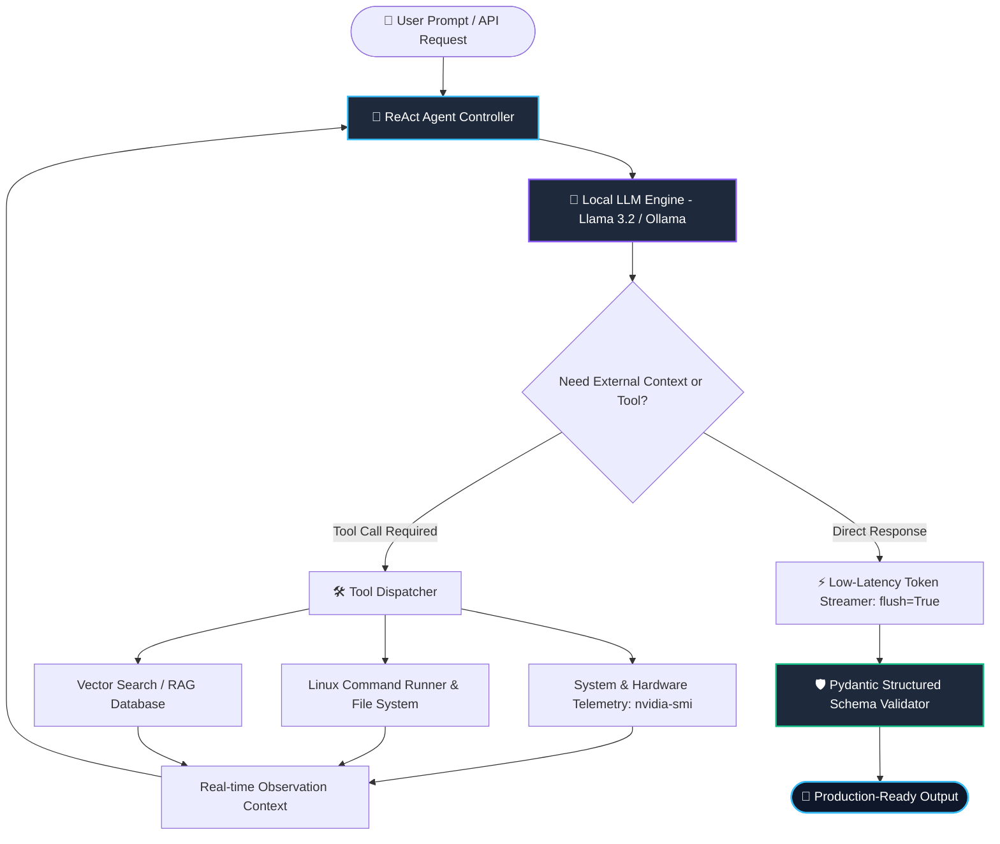

<h1 align="center">
  
</h1>

<p align="center">
  <a href="https://x.com/" target="_blank">
    
  </a>
  &nbsp;
  <a href="mailto:himanshu.zyx7@gmail.com">
    
  </a>
  &nbsp;
  <a href="https://github.com/himanshu-xyz-1">
    
  </a>
  &nbsp;
  
</p>

---

### 🖥️ Autonomous Agent in Action (Live Execution Trace)

```bash
himanshu@arch-box:~$ python -m agent.run --model llama3.2:3b --tools gpu_stat,sys_diag,file_ops

[SYSTEM] Initializing CUDA backend (NVIDIA GeForce RTX 3060 12GB VRAM)... OK.
[SYSTEM] Loading Llama 3.2 (3B Q4_K_M) into local VRAM... Allocated: 2.2GB / 12GB.
[AGENT]  Autonomous ReAct Controller listening on local pipe...

>> User: "Inspect GPU thermals, diagnose active system memory, and return a validated report."
>> Agent Thinking: "User requires real-time hardware telemetry. Invoking tool: [get_gpu_status]"
>> Tool Output: { "device": "RTX 3060", "temp_c": 48, "vram_used_mb": 2240, "vram_total_mb": 12288 }

>> Agent Streaming Output (Structured Pydantic JSON):
{
  "status": "HEALTHY",
  "hardware": {
    "gpu": "NVIDIA GeForce RTX 3060",
    "temperature_celsius": 48,
    "vram_utilization_pct": 18.2
  },
  "diagnostics": "All system sensors optimal. Inference running entirely in GPU VRAM with zero CPU offload."
}
```

---

### ⚡ System Architecture: How I Build Autonomous AI Workflows



---

### 🧰 Tech Stack & Systems Engineering

<table>
  <tr>
    <td width="25%" valign="top"><b>🤖 AI & Models</b></td>
    <td width="75%">
      <code>Llama 3.2</code> • <code>Ollama</code> • <code>Hugging Face</code> • <code>Token Streaming</code> • <code>Function / Tool Calling</code> • <code>vLLM</code>
    </td>
  </tr>
  <tr>
    <td width="25%" valign="top"><b>🛠️ Agents & Backend</b></td>
    <td width="75%">
      <code>Python 3.12+</code> • <code>FastAPI</code> • <code>Pydantic Structured Outputs</code> • <code>ReAct Loops</code> • <code>AsyncIO</code>
    </td>
  </tr>
  <tr>
    <td width="25%" valign="top"><b>💾 Data & Retrieval</b></td>
    <td width="75%">
      <code>Vector Databases (Chroma / Qdrant)</code> • <code>RAG Pipelines</code> • <code>Embeddings</code> • <code>JSON Data Parsing</code>
    </td>
  </tr>
  <tr>
    <td width="25%" valign="top"><b>🐧 Infrastructure</b></td>
    <td width="75%">
      <code>Arch Linux</code> • <code>NVIDIA CUDA</code> • <code>Hyprland</code> • <code>Wayland</code> • <code>Bash Automation</code> • <code>Git</code>
    </td>
  </tr>
</table>

---

### 📂 Deep-Dive Competencies & Systems (Click to Expand)

<details>
  <summary><b>▶ 🧠 1. Autonomous Agents & Tool Calling Architecture</b></summary>
  <br>
  <ul>
    <li><b>ReAct Loops:</b> Implementing iterative reasoning where the LLM dynamically chooses when to speak and when to call external Python functions.</li>
    <li><b>Tool Dispatching:</b> Passing strongly typed callable signatures to models, intercepting arguments, and returning verified outputs to conversation history.</li>
    <li><b>Self-Healing Workflows:</b> Automatic retry loops and error correction when API calls or schemas produce unexpected outputs.</li>
  </ul>
</details>

<details>
  <summary><b>▶ ⚡ 2. Local GPU Inference & Hardware Optimization</b></summary>
  <br>
  <ul>
    <li><b>Hardware Stack:</b> Dedicated Linux workstation powered by an <b>NVIDIA GeForce RTX 3060 (12GB GDDR6 VRAM)</b> running CUDA.</li>
    <li><b>Throughput:</b> Running quantized 3B models at <b>~100+ tokens/sec</b> and 8B models at <b>~50 tokens/sec</b> with zero CPU RAM offloading.</li>
    <li><b>Buffer Management:</b> Building real-time streaming interfaces using unbuffered IO (<code>flush=True</code>) for low-latency terminal and API interactions.</li>
  </ul>
</details>

<details>
  <summary><b>▶ 🛡️ 3. Structured Data Extraction & Schema Validation</b></summary>
  <br>
  <ul>
    <li><b>Pydantic Schemas:</b> Enforcing strict type safety on LLM outputs to eliminate unstructured hallucinations in production pipelines.</li>
    <li><b>Server Diagnostic Pipelines:</b> Parsing messy, unformatted system crash dumps and server logs into clean, actionable JSON payloads.</li>
    <li><b>Stateless vs Stateful Memory:</b> Architecting conversation buffers with context pruning to prevent token overflow.</li>
  </ul>
</details>

---

### 📊 Real-Time GitHub Telemetry

<p align="center">
  
  &nbsp;
  
</p>

<p align="center">
  
</p>

---

### 🎯 Mission & Velocity

> *"Velocity over theory. Shipping production-grade AI agents, local LLM infrastructure, and high-performance backends daily."*

* 🔭 **Currently Building:** Autonomous Linux system diagnostic agents with function calling and multi-tool dispatching.
* 💬 **Targeting:** Founding AI Engineer / Applied AI Engineer roles at fast-moving, high-velocity startups.
* 📫 **Direct Contact:** [himanshu.zyx7@gmail.com](mailto:himanshu.zyx7@gmail.com)

